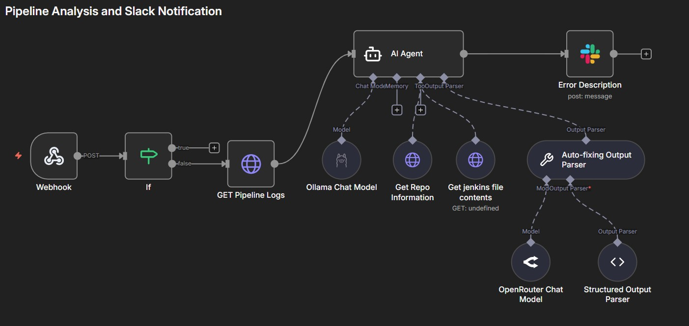

# Jenkins Pipeline Auto-Fix Agent

An n8n automation workflow that analyzes failed Jenkins builds using AI, suggests fixes, and allows one-click pipeline repairs via Slack.

---


This project automates the process of diagnosing and fixing Jenkins pipeline failures by:
- Analyzing build failure logs with AI
- Providing root-cause analysis and corrected pipeline code
- Enabling one-click fixes directly from Slack

---

## 🔄 n8n Workflows:

### Workflow 1: Pipeline Analysis & Notification

```
Jenkins Failure → Webhook → AI Analysis → Slack Notification
```



1. **Jenkins Notification Plugin** sends build failure data to n8n webhook
2. **AI Agent** receives the logs and:
   - Fetches job config XML via Jenkins API (extracts SCM repo info)
   - Retrieves original Jenkinsfile from GitHub
   - Analyzes errors and generates a corrected pipeline
3. **Slack** receives a formatted message with:
   - Error details and possible causes
   - Fix instructions
   - Corrected pipeline code
   - **"Apply Changes"** button

### Workflow 2: Apply Fix & Trigger Build

```
Slack Button → Webhook → GitHub Update → Jenkins Build → Slack Confirmation
```


1. User clicks **"Apply Changes"** in Slack
2. Workflow updates the Jenkinsfile via GitHub API
3. Triggers a new Jenkins build
4. Sends confirmation to Slack with links to:
   - Updated Jenkinsfile on GitHub
   - New build status page

---

## 🛠️ Tech Stack

| Component | Technology |
|-----------|------------|
| Automation | n8n (self-hosted via Docker) |
| CI/CD | Jenkins (Docker) |
| AI Models | OpenRouter / Ollama Cloud (`gpt-oss:120b`) |
| Notifications | Slack (Block Kit) |
| Tunnel/HTTPS | Zrok (free static DNS) |
| SCM | GitHub |

Both n8n and Jenkins are deployed locally using **Docker Compose**.
n8n is exposed via **Zrok** with HTTPS (required for Slack interactivity).

## Credentials Required

| Service | Credential Type |
|---------|-----------------|
| GitHub | Personal Access Token (PAT) |
| Jenkins | API Token |
| Slack | Bot Token (OAuth) |
| OpenRouter/Ollama-Cloud  | API Key |
| Webhook | Header Auth Token |

---

## 🤖 AI Agent Prompt

The AI agent is configured to:

- **Input**: Jenkins console logs + original Jenkinsfile
- **Process**: Identify errors, determine root cause, generate fix
- **Output**: Structured JSON with:
  - Exact error excerpt
  - Error definition and possible causes
  - Fix summary and step-by-step instructions
  - Full corrected pipeline code

 **=> [View the Prompt](./Prompt.md)**

The agent uses an **Auto-fixing Output Parser** to ensure valid JSON output.

**Output Schema:**

```json
{
  "error": "Exact error line from logs",
  "explanation": {
    "definition": "What this error means",
    "possible_causes": ["Cause 1", "Cause 2", "Cause 3"]
  },
  "suggested_solution": {
    "summary": "Best fix for this issue",
    "fix_instructions": ["Step 1", "Step 2", "Step 3"],
    "corrected_pipeline": "Full fixed Jenkinsfile content"
  }
}
```

## Future Improvements and Features

- Improverd error handeling.
- Split AI analysis tasks for better effeciency.
- Implement another wokflow for real time messaging in Slack with the model to retirve information about the general status of the jenkins server and jobs.
